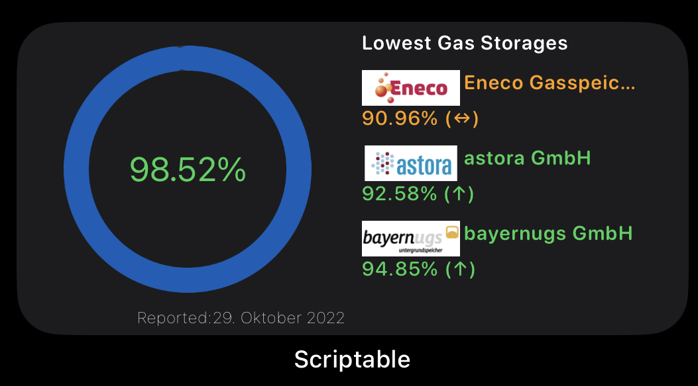
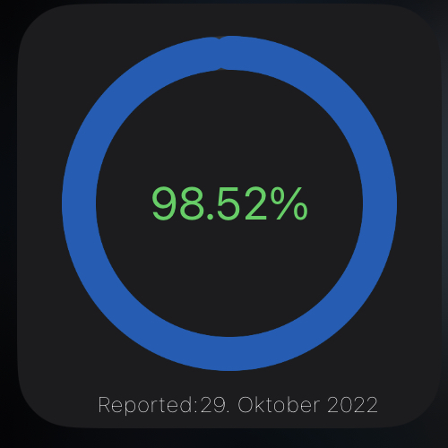

# Level of European Gas Storage

Widget for overview the country’s level of gas storage(s).



## Installation

1. [Install Scriptable App](https://scriptable.app)
2. Copy [Level of gas storage.js](./Level of gas storage.js) into [Scriptable App](https://scriptable.app) folder

## Configuration

Currently the Widget is pre-configured for Germany. If you want information about another European country you’ll have to change the lines 11 and 12. E.g.:

```
const countryName = ‚France‘
const country = ‚fr‘
```

**Please Note: Depending on the information that are available for your country and the widget size many requests will be done**

## Available widget sizes

### Small



The small widget will display the current country gas storage level as a circle chart combined with the current percentage number. You will also get the information when this level was reported.

### Medium


The medium sized widget is divided into two parts (left and right side)

**Left Side**

Will display the current country gas storage level as a circle chart combined with the current percentage number. You will also get the information when this level was reported.

**Right Side**

Depending on country it will display a maximum of the three lowest leveled gas storage companies.

## Notes

### Status/Trend (color and arrow)

If the storage level (for a country and for a company) is higher, equal or less than the day before is displayed by colors and arrows:

<dl>
  <dt>Orange (`↔︎`)</dt>
  <dd>The Level trend stays equal</dd>

  <dt>Green (`↑`)</dt>
  <dd>The Level trend is rising</dd>

  <dt>Red (`↓`)</dt>
  <dd>The level of gas storage trend sinking</dd>

</dl>  
