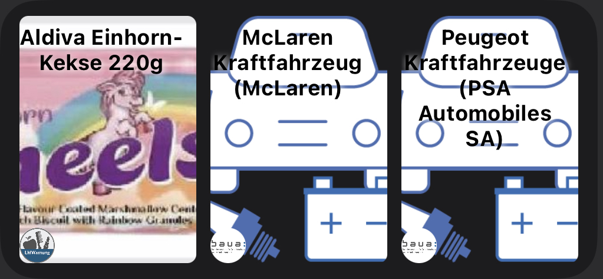

# Lebensmittel- und Produktwarnung Widget

Widget zur Anzeige von Lebensmittelwarnungen herausgegeben vom Bundesamt für Verbraucherschutz und Lebensmittelsicherheit (BVL) und/oder Produktwarnungen herausgegeben von der Bundesanstalt für Arbeitsschutz und Arbeitsmedizin (BAuA)

Quellen: 
* [https://www.baua.de](https://www.baua.de/DE/Home/Home_node.html)
* [https://www.baua.de](https://www.lebensmittelwarnung.de/bvl-lmw-de/liste/alle/deutschlandweit/10/0)

- [Installation](#installation)
- [Konfiguration](#konfiguration)
- [Verfügbare Widgets](#verfügbare-widgets)
  - [Klein (Small)](#klein-small)
  - [Mittel (medium)](#mittel-medium)
- [Hinweise](#hinweise)

## Installation

1. [Download Scriptable App](https://scriptable.app)
2. Kopiere [LmP-Warnungen.js](./LmP-Warnungen.js) in dein [Scriptable App](https://scriptable.app) Verzeichnis

## Konfiguration

Das Widget kommt komplett ohne jegliche Konfiguration aus und zeigt immer die letzten drei Warnmeldungen an.

Über Variablen (`includeProducts` und `includeFood`) kann man die [BAuA Produktwarnungen](https://www.baua.de/DE/Home/Home_node.html) oder die [BVA Lebensmittel Warnungen](https://www.lebensmittelwarnung.de/bvl-lmw-de/liste/alle/deutschlandweit/10/0) anzeigen (`true`) oder ausblenden (`false`)

## Verfügbare Widgets

### Klein (Small)

Das kleine Widget stellt immer die letzte Lebensmittel- oder Produktwarnung dar.

### Mittel (medium)

Das mittelgroße zeigt immer die letzten drei Lebensmittel- oder Produktwarnungen an.

## Hinweise

Die einzelnen Meldungen können für mehr Informationen angeklickt werden. Dabei wird man auf die entsprechende Webseite weitergeleitet.

