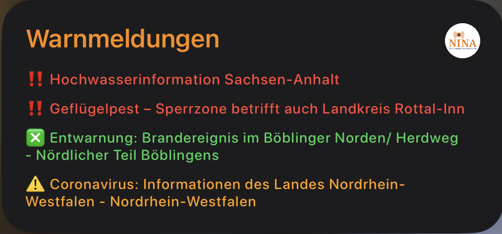
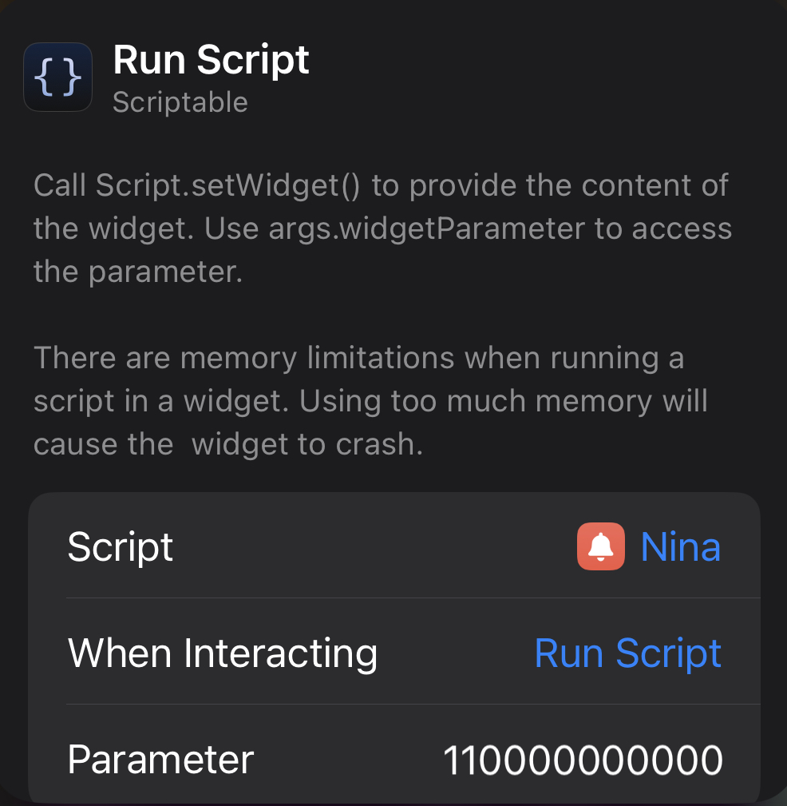

# NINA - Warnmeldungen Widget

Widget zur Anzeige von NINA - Warnmeldungen herausgegeben vom BBK

Quelle: [https://warnung.bund.de](https://warnung.bund.de/startseite)

- [Installation](#installation)
- [Konfiguration](#konfiguration)
  - [Aussehen und Anzeige](#aussehen-und-anzeige)
- [Verfügbare Widgets](#verfügbare-widgets)
  - [Klein (Small)](#klein-small)
  - [Mittel (medium)](#mittel-medium)
- [Hinweise](#hinweise)
  - [Status (farbliche Markierung)](#status-farbliche-markierung)
  - [Status (Icons)](#status-icons)

## Installation

1. [Download Scriptable App](https://scriptable.app)
2. Kopiere [NINA.js](./NINA.js) in dein [Scriptable App](https://scriptable.app) Verzeichnis

## Konfiguration

Das mittelgroße Widget kommt komplett ohne jegliche Konfiguration aus und zeigt immer die letzten vier Warnmeldungen an.

Das kleine Widget wird für die Anzeige von Standort bezogenen Warnmeldungen verwendet. Dafür wird allerdings ein 12-stelliger Amtlicher Regionalschlüssel (ARS) benötigt. Die `110000000000` ist zum Beispiel der Regionalschlüssel von Berlin. Diesen trägt man einfach in die Widget-Konfiguration ein.

Das Länderübergreifendes Hochwasser Portal (LHP) und der Deutsche Wetterdienst (DWD) können in bestimmten Fällen relativ viele Warnmeldungen veröffentlichen. Aus diesem Grund besteht die Möglichkeit diese beiden Dienste aus der Liste zu entfernen. Dazu müssen die entsprechenden Variablen (`includeDWD` und `includeLHP`) im Skript auf `true` (Anzeigen) bzw. `false` (Ausblenden) gesetzt werden.

### Aussehen und Anzeige

Das Aussehen und die Werte die zur Anzeige geebracht werden können/sollen, können im Script bearbeitet werden. 

## Verfügbare Widgets

### Klein (Small)

Das kleine Widget wird für die Anzeige von Standort bezogenen Warnmeldungen verwendet.

### Mittel (medium)

Das mittelgroße Widget kommt komplett ohne jegliche Konfiguration aus und zeigt immer die letzten vier Warnmeldungen an. 

## Hinweise

Die einzelnen Meldungen können für mehr Informationen angeklickt werden. Dabei wird man auf die entsprechende Webseite weitergeleitet.

### Status (farbliche Markierung)

Der Status der Warnmeldungen wird farblich markiert:

<dl>
  
  <dt>Rot</dt>
  <dd>Aktuelle Warnmeldung</dd>

  <dt>Orange</dt>
  <dd>Aktualisierung einer bereits bestehenden Warnmeldung</dd>

  <dt>Grün</dt>
  <dd>Entwarnung einer zuvor veröffentlichten Warnmeldung</dd>

</dl>  

### Status (Icons)

Der Status der Warnmeldungen wird durch Icons markiert:

<dl>
  <dt>‼️</dt>
  <dd>Aktuelle Warnmeldung</dd>

  <dt>⚠️</dt>
  <dd>Aktualisierung einer bereits bestehenden Warnmeldung</dd>

  <dt>✅</dt>
  <dd>Entwarnung einer zuvor veröffentlichten Warnmeldung</dd>

</dl>