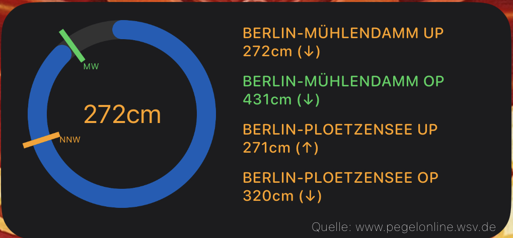
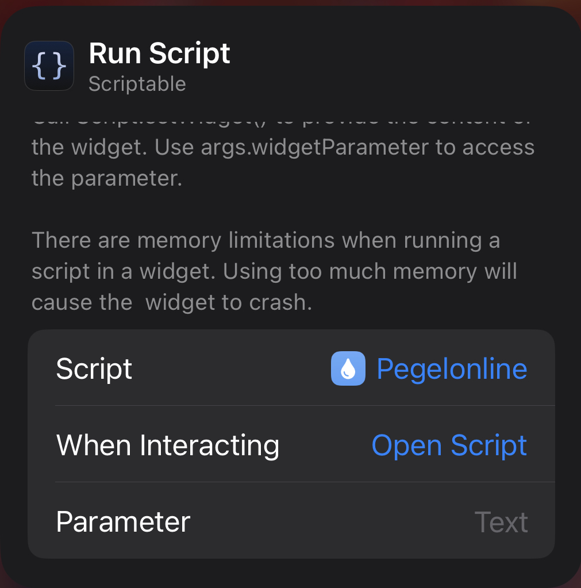
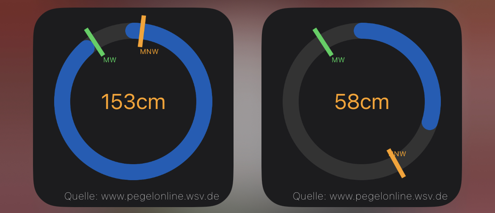

# PegelOnline Widget

Widget zur Anzeige von Pegelständen.

Quelle: [www.pegelonline.wsv.de](www.pegelonline.wsv.de)

- [Installation](#installation)
- [Konfiguration](#konfiguration)
  - [Aussehen und Anzeige](#aussehen-und-anzeige)
- [Verfügbare Widgets](#verfügbare-widgets)
  - [Klein (Small)](#klein-small)
  - [Mittel (medium)](#mittel-medium)
- [Hinweise](#hinweise)
  - [Status (farbliche Markierung)](#status-farbliche-markierung)
  - [Abkürzungen](#abkürzungen)
  - [Tendenz](#tendenz)

## Installation

1. [Download Scriptable App](https://scriptable.app)
2. Kopiere [Pegelonline.js](./Pegelonline.js) in dein [Scriptable App](https://scriptable.app) Verzeichnis

## Konfiguration

Das Widget kommt komplett ohne jegliche Konfiguration aus. In diesem Fall wird der aktuelle Standort verwendet um die entsprechende(n) nächstgelegenen Stationen zu ermitteln und die/den Pegelstände/Pegelstand anzuzeigen. 

Will man allerdings immer die/den Pegelstände/Pegelstand von bestimmten Stationen erhalten so können diese über die Messstellennummer(n) der entsprechenden Stationen festgelegt werden.

Z.B.: `580060,47900107,3550040`

### Aussehen und Anzeige

Das Aussehen und die Werte die zur Anzeige geebracht werden können/sollen, können im Script bearbeitet werden. 

## Verfügbare Widgets

### Klein (Small)

Das kleine Widget stellt immer nur den Pegelstand **einer** Station dar. Dabei wird der aktuelle Pegelstand im Vergleich zu den entsprechenden Mittelwerten in einem Kreisdiagramm dargestellt. Im inneren des Kreisdiagramms befindet sich der aktuelle Pegelstand. 

### Mittel (medium)

Das mittelgroße Widget kann den aktuellen Pegelstand von vier Stationen gleichzeitig darstellen. Hierbei werden alle vier Stationen mit Namen, den aktuellen Pegelstand, Status und die Tendenz dargestellt. Zusätzlich wird der aktuelle Pegelstand von der ersten Station noch einmal extra als Kreisdiagramm (siehe [Kleines Widget](#klein-small)) dargestellt. 

## Hinweise

### Status (farbliche Markierung)

Der Status setzt den aktuellen Wasserstand entweder mit den mittleren niedrigsten Werten (MNW) und den mittleren höchsten Werten (MHW) in Beziehung:

<dl>
  <dt>Orange</dt>
  <dd>Aktueller Wasserstand unterhalb/gleich des MNW</dd>

  <dt>Grün</dt>
  <dd>Aktueller Wasserstand zwischen MNW und MHW bzw. zwischen 0 und HSW</dd>

  <dt>Rot</dt>
  <dd>Aktueller Wasserstand oberhalb/gleich MHW bzw. HSW</dd>

  <dt>Gelb</dt>
  <dd>Unbekannt, da MHW/MNW bzw. HSW für Zeitreihe nicht vorhanden / Fehlfunktion oder Störung. Siehe Subressource comment in Ressource Timeseries / Aktueller Wasserstand veraltet (älter als 25 Stunden)</dd>
</dl>  

### Abkürzungen

Die Liste der Abkürzungen vom (meistens) höchsten zum niedrigsten Wert:

<dl>
  <dt>HHW</dt>
  <dd>Höchster Hochwasserstand</dd>

  <dt>MHW</dt>
  <dd>Mittel der Hochwasserstände</dd>

  <dt>M_III</dt>
  <dd>Hochwassermarke III</dd>

  <dt>M_II</dt>
  <dd>Hochwassermarke II</dd>

  <dt>HSW</dt>
  <dd>höchster Schifffahrtswasserstand</dd>

  <dt>M_I</dt>
  <dd>Hochwassermarke I</dd>

  <dt>MW</dt>
  <dd>Mittel der Tageswasserstände</dd>
  
  <dt>MNW</dt>
  <dd>Mittel der Niedrigwasserstände</dd>

  <dt>NNW</dt>
  <dd>Niedrigster Niedrigwasserstand</dd>
</dl>

### Tendenz

Zeigt die Entwicklung des Wasserstandes an:

<dl>
  <dt>↓</dt>
  <dd>fallend</dd>

  <dt>↔︎</dt>
  <dd>gleichbleibend</dd>

  <dt>↑</dt>
  <dd>steigend</dd>

  <dt>❓</dt>
  <dd>Tendenz kann nicht ermittelt werden</dd>
</dl>