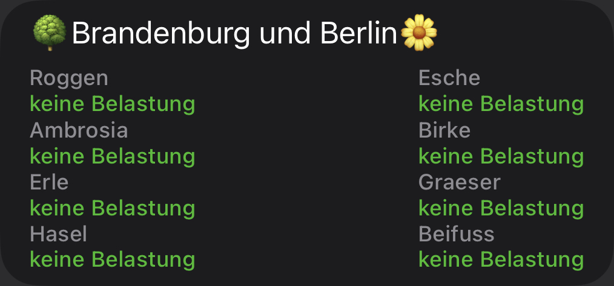
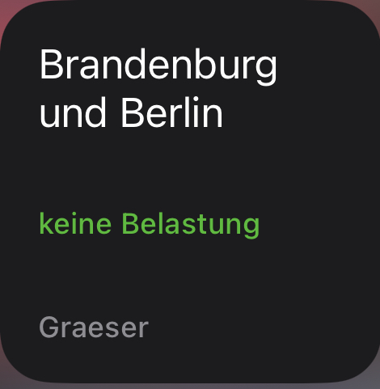

# Pollen Alarm Widget

Der [Pollenflug-Gefahrenindex](https://www.dwd.de/DE/leistungen/gefahrenindizespollen/gefahrenindexpollen.html) vom Deutschen Wetterdienst als Scriptable Widget.

> Für die acht allergologisch wichtigsten Pollen in Deutschland (Hasel, Erle, Esche, Birke, Süßgräser, Roggen, Beifuß und Ambrosia) werden die in der Luft zu erwartenden Pollenkonzentrationen dargestellt.

Quelle: [DWD Gefahrenindex Pollen](https://www.dwd.de/DE/leistungen/gefahrenindizespollen/gefahrenindexpollen.html)

- [Installation](#installation)
- [Konfiguration](#konfiguration)
  - [Aussehen und Anzeige](#aussehen-und-anzeige)
- [Verfügbare Widgets](#verfügbare-widgets)
  - [Klein (Small)](#klein-small)
  - [Mittel (medium)](#mittel-medium)
- [Hinweise](#hinweise)
  - [Status (farbliche Markierung)](#status-farbliche-markierung)
  - [Abkürzungen](#abkürzungen)
  - [Tendenz](#tendenz)

## Installation

1. [Download Scriptable App](https://scriptable.app)
2. Kopiere [PollenAlarm.js](./PollenAlarm.js) in dein [Scriptable App](https://scriptable.app) Verzeichnis

## Konfiguration

Das Widget kommt komplett ohne jegliche Konfiguration aus. In diesem Fall wird die Pollenkonzentration allen acht Pollen für Berlin und Brandenburg angezeigt.

Vor allem für das kleine Widget ist es sinnvoll sich auf eine Pollenart festzulegen, da der Platz nicht für alle acht ausreichend ist. Dazu einfach den Regionschlüssel und Pollentyp mit Komma (`,`) getrennt in die Widget Konfiguration eintragen. Z.B.:

`50,Graeser`.

### Aussehen und Anzeige

Das Aussehen und die Werte die zur Anzeige gebracht werden können/sollen, können im Script bearbeitet werden. 

## Verfügbare Widgets

### Klein (Small)

// @Todo

### Mittel (medium)

// @Todo

## Hinweise

### Pollenkonzentration + farbliche Markierung

Die Pollenkonzentration wird textuell mit farblicher Markierung angezeigt:

(Sortiert von der höchsten bis zur geringsten Belastung)

<ol>

  <li style="color:#e70003">hohe Belastung</li>
  
  <li style="color:#ff8181">mittlere bis hohe Belastung</li>
  
  <li style="color:#ffac00">mittlere Belastung</li>
  
  <li style="color:#ffd680">geringe bis mittlere Belastung</li>
  
  <li style="color:#feff00">geringe Belastung</li>
  
  <li style="color:#d8ff9c">keine bis geringe Belastung</li>
  
  <li style="color:#35bc23">keine Belastung</li>
  
  <li style="color:#fffff">keine Daten</li>

</ol>

### Regionschlüssel

Der Pollenflug Gefahrenindex wird für verschiedene Regionen zur Verfügung gestellt. Folgende Regionen und Werte stehen zur Verfügung: 

<dl>

  <dt>10</dt>
  <dd>Schleswig-Holstein und Hamburg</dd>

  <dt>11</dt>
  <dd>Inseln und Marschen</dd>
  
  <dt>12</dt>
  <dd>Geest,Schleswig-Holstein und Hamburg</dd>
  
  <dt>20</dt>
  <dd>Mecklenburg-Vorpommern</dd>
  
  <dt>30</dt>
  <dd>Niedersachsen und Bremen</dd>  
  
  <dt>31</dt>
  <dd>Westl. Niedersachsen/Bremen</dd>
  
  <dt>32</dt>
  <dd>Östl. Niedersachsen</dd>
  
  <dt>40</dt>
  <dd>Nordrhein-Westfalen</dd>
  
  <dt>41</dt>
  <dd>Rhein.-Westfäl. Tiefland</dd>
  
  <dt>42</dt>
  <dd>Ostwestfalen</dd>
  
  <dt>43</dt>
  <dd>Mittelgebirge NRW</dd>
  
  <dt>50</dt>
  <dd>Brandenburg und Berlin</dd>
  
  <dt>60</dt>
  <dd>Sachsen-Anhalt</dd>
  
  <dt>61</dt>
  <dd>Tiefland Sachsen-Anhalt</dd>
  
  <dt>62</dt>
  <dd>Harz</dd>
  
  <dt>70</dt>
  <dd>Thüringen</dd>
  
  <dt>71</dt>
  <dd>Tiefland Thüringen</dd>
  
  <dt>72</dt>
  <dd>Mittelgebirge Thüringen</dd>
  
  <dt>80</dt>
  <dd>Sachsen</dd>
  
  <dt>81</dt>
  <dd>Tiefland Sachsen</dd>
  
  <dt>82</dt>
  <dd>Mittelgebirge Sachsen</dd>
  
  <dt>90</dt>
  <dd>Hessen</dd>
  
  <dt>91</dt>
  <dd>Nordhessen und hess. Mittelgebirge</dd>
  
  <dt>92</dt>
  <dd>Rhein-Main</dd>
  
  <dt>100</dt>
  <dd>Rheinland-Pfalz und Saarland</dd>
  
  <dt>101</dt>
  <dd>Rhein, Pfalz, Nahe und Mosel</dd>
  
  <dt>102</dt>
  <dd>Mittelgebirgsbereich Rheinland-Pfalz</dd>
  
  <dt>103</dt>
  <dd>Saarland</dd>
  
  <dt>110</dt>
  <dd>Baden-Württemberg</dd>
  
  <dt>111</dt>
  <dd>Oberrhein und unteres Neckartal</dd>
  
  <dt>112</dt>
  <dd>Hohenlohe/mittlerer Neckar/Oberschwaben</dd>
  
  <dt>113</dt>
  <dd>Mittelgebirge Baden-Württemberg</dd>
  
  <dt>120</dt>
  <dd>Bayern</dd>
  
  <dt>121</dt>
  <dd>Allgäu/Oberbayern/Bay. Wald</dd>
  
  <dt>122</dt>
  <dd>Donauniederungen</dd>
  
  <dt>123</dt>
  <dd>Bayern nördl. der Donau, o. Bayr. Wald, o. Mainfranken</dd>
  
  <dt>124</dt>
  <dd>Mainfranken</dd>

</dl>

### Pollenarten

Mögliche Schlüsselnamen der Pollenarten sind:

* `Hasel`
* `Erle`
* `Esche`
* `Birke`
* `Graeser`
* `Roggen`
* `Beifuss`
* `Ambrosia`
